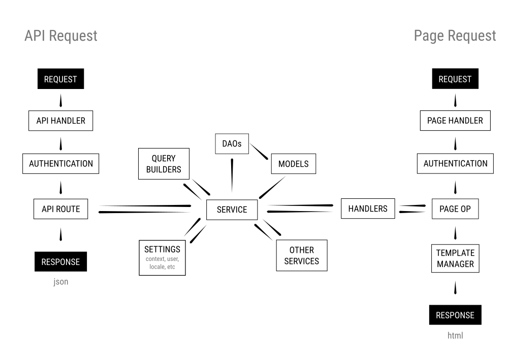

# Overview of API-driven Architecture

This document outlines some of the architectural changes that were introduced with OJS 3.1. Over time, these patterns are intended to replace portions of the architecture which currently serve the backend editorial interface.

## Refactor Strategy

The goal is to pull much of the business logic \(creating, updating, deleting objects\) out of the `Handler` components and put it into new service classes. These Service classes will not be responsible for responding to requests, allowing them to be used by any `Handler` \(API, Page or Controller\).

OJS 3.1 replaced the submissions grids with a new `Handler` for submission lists. This component consists of a client-side component built with Vue.js and interacts directly with the REST API to update itself from the server.

As we refactor, we'll identify other Controller components we can replace with the new architecture, gradually bringing more of the application logic into the Service classes.

## Request Flow

Here's an example of what this flow looks like when someone visits the submission dashboard in the backend.

1. The **Page Request** is picked up by `DashboardHandler` , **Authorized**, then passed to the **Page Op** `DashboardHandler::index()`.
2. Instances of the **Handler** `SubmissionsListHandler` are created, one for each submissions list, and passed parameters to initialize the controllers \(for example, whether to retrieve assigned, unassigned, active or archived submissions\).

3. `SubmissionsListHandler` asks the **Service** `SubmissionService` to fetch submissions according to the parameters with which it was created. `SubmissionService`interacts with `SubmissionListQueryBuilder` , `SubmissionDAO` and other service classes, like `AuthorService`and `GalleyService` to fetch submission data.

4. This data is passed to the **Template Manager**, where it's embedded into the `HTML` **Response** so that the submission list component is initialized on the client side.

5. When the client needs to interact with the server, it makes an **API Request**. In this example, it asks for a new submissions list based on a search query \(`GET /api/v1/submissions?searchPhrase=<phrase>`\).

6. The **API Request** is picked up by the **API Handler** `SubmissionHandler`, **Authorized**, then passed to the **API Route** `SubmissionHandler::getSubmissionList()`.

7. `SubmissionHandler` asks the **Service** `SubmissionService` to fetch submissions according to the search parameters. `SubmissionService` repeats its role in step 3.

8. This data is returned as a `JSON` **Response**.

With this flow, the Service classes should encapsulate all of the business logic that is shared between the Page and API requests.

## Page Handlers

Where possible, actions which currently `POST` data to Page Handlers should eventually interact with the API instead. New client components should always interact with the API, not a Page Handler.

The end goal is for Page Handlers to initialize the display of key routes \(dashboard, issues, settings, tools\), but not receive any follow-up requests \(like saving a form or loading a tab\).

## Controller Handlers

Our existing controller handlers \(grids, forms, tabs, modals, etc\) receive `GET` and `POST` requests directly. New controllers off-load this responsibility to the API Handlers.

Instead, a new controller handler will only initialize and \(optionally\) hydrate a client-side component. This will typically include passing localized labels, configuration parameters, and initial data to client-side components.

You can find these client-side components in the UI Library, which documents the data structure that each component expects to receive when created.

## Services

Services coordinate with DAOs, Models and other Services to perform actions such as creating, reading, updating and deleting data. Services are responsible for generalizing the business logic which currently exists in specific Page and Controller `op` handlers, so that it can be used with any request.

An example of business logic for a service class is the `PKPSubmissionService::getWorkflowUrlByUserRoles()` method. This method coordinates the  `User` , `Context` , `SubmissionDAO`, `StageAssignmentDAO`, and `Dispatcher`classes to generate the appropriate URL depending on the user: to the submission wizard, author dashboard, review request or editorial workflow.

Services are created to accompany objects within the system. We already have `SubmissionService`, `AuthorService`, `IssueService`, `GalleyService`, `SectionService`and `NavigationMenuService` classes. We plan to build more as we extend the API and bring more of the business logic out of the Page and Controller `op` handlers.

### Using a Service

Services are available globally through the `ServicesContainer`. For example, you can retrieve the Submission Service like this:

```php
$submissionService = ServicesContainer::instance()->get('submission');
```

Or use a Service method directly like this:

```php
$submissions = ServicesContainer::instance()
    ->get('submission')
    ->getSubmissions($context->getId(), $params);
```

### Entity Property Interface for Services

The REST API, and the UI components which consume it, read data in `JSON` format. When delivering data in an API response, we must transform data that is associated with an object into `JSON`.  For example, a meaningful representation of a `Submission` object requires that we attach information about associated `Author`, `Galley`, `File`, `Issue` , `Section` , and `StageAssignment`objects.

_\(PHP Objects can not reliably be converted to _`JSON`_, so if we want to convert the data to _`JSON`_ we must compile the data in an associative array.\)_

When this is necessary, a Service class will extend the `PKPBaseEntityPropertyService`, which implements the `EntityPropertyInterface`. This interface includes methods for generating an associative array of the object and coordinating any associated data. This entails the use of three methods:

* `getProperties()` generates the associative array representing the object.
* `getSummaryProperties()` wraps `getProperties()` to generate the associative array of a summary representation of the object. \(Often used in API responses which list items.\)
* `getFullProperties()` wraps `getProperties()` to generate the associative array of a full representation of the object. \(Often used in API responses which show a single item.\)

The following example shows how  `SubmissionService` can be used to retrieve an array of `Submission` objects and compile the entity properties for conversion to `JSON`:

```php
$submissions = $submissionService->getSubmissions($contextId, $params);
foreach ($submissions as $submission) {
    $items[] = $submissionService->getSummaryProperties($submission, array('request' => $request));
}
```

Services which implement the `EntityPropertyInterface` should interact well. For example, `SubmissionService` will rely on `AuthorService` to get the authors of a submission:

```php
$authors = $submission->getAuthors();
foreach ($authors as $author) {
    $authorOutput[] = ServicesContainer::instance()
            ->get('author')
            ->getSummaryProperties($author, $args);
}
```

#### Extending Entity Properties with Additional Data

Services which extend `EntityPropertyInterface` should provide a consistent set of hooks which allow additional properties to be attached to an object. This is used, for example, to attach section information to a submission in OJS, and series/category information to a submission in OMP.

The following hooks illustrate how this works in the `SubmissionService` class:

* `Submission::getProperties::values` allows you to add properties to the representation of a submission.
* `Submission::getProperties::summaryProperties`allows you to ask for an additional property to be added to the summary representation of a submission.
* `Submission::getProperties::fullProperties` allows you to ask for an additional property to be added to the full representation of a submission.

The summary and full representations of an entity determine what information is returned in the API. If you are writing a plugin which adds information to an entity, you should _always_ include that information in the properties list to ensure it is exposed in the API. This includes plugins which add information like DOIs and ORCIDs.

### Service Getters

The `SubmissionService::getSubmissions()` makes use of `SubmissionListQueryBuilder` to implement a flexible approach to fetching submissions from the database. This allows us to build complex conditional queries, so we can, for instance, get 10 submissions in the copyediting stage that are assigned to the current user and order them alphabetically.

To accomplish this, we use `SubmissionListQueryBuilder`, which extends the `Illuminate` database query builder from Laravel. This allows us to inject query parameters at arbitrary points and still build a working query.

Only Submissions have such a getter at this time. But we hope to build one for other objects where we need complex conditional queries, such as filtering reviewer and user lists. When doing so, hooks must be added to ensure the query can be modified. For example, OJS hooks in to add conditional query params for sections, and OMP does the same for series/categories.

Two hooks are used for Submissions: `Submission::getSubmissions::queryBuilder` to handle any params passed for the request and `Submission::getSubmissions::queryObject`to implement any custom query statements required.

## UI Handlers and Vue.js Components

To integrate our new Vue.js components with our existing UI, we need to be able to inject a component into the page at any time, including inside of a modal or lazy-loaded tab. To accomplish this, each Vue.js component is paired with a PHP Handler which collects the information needed to initialize that component.

For example, the `SubmissionsListHandler` compiles an associative array that can be converted to `JSON` and passed to the Vue.js`SubmissionsListPanel` component. The data each component requires is described in the UI Library. The `SubmissionsListPanel` expects localized labels, configuration parameters such as which submissions to fetch, information about the filters, the API path to send update requests, and more.

This array is then passed to the Template Manager, where it is embedded inside of a `<script>` tag which will initialize the component. This is an example of how the My Queue submissions list is configured and passed to the Template Manager:

```php
$myQueueListHandler = new SubmissionsListHandler(array(
    'title' => 'common.queue.long.myAssigned',
    'getParams' => array(
        'status' => STATUS_QUEUED,
        'assignedTo' => $request->getUser()->getId(),
    ),
));
$templateMgr->assign('myQueueListData', json_encode($myQueueListHandler->getConfig()));
```

And here's an example of how that component is then initialized in the HTML template:

```php
{assign var="uuid" value=""|uniqid|escape}
<div id="my-submission-list-handler-{$uuid}">
    <script type="text/javascript">
        pkp.registry.init('my-submission-list-handler-{$uuid}', 'SubmissionsListPanel', {$myQueueListData});
    </script>
</div>
```

### Passing Constants to Components

As we move more of the UI logic into the Vue.js components, we'll need many of the constants on the frontend. You can pass constants to any component using the `_constants` key in the array of data passed to initialize the component.

```php
$config['_constants'] = array(
    'WORKFLOW_STAGE_ID_SUBMISSION' => WORKFLOW_STAGE_ID_SUBMISSION,
    'WORKFLOW_STAGE_ID_INTERNAL_REVIEW' => WORKFLOW_STAGE_ID_INTERNAL_REVIEW,
);
```

These constants will be stored globally and can be accessed in Vue.js components like this:

```js
stageBadgeClass: function () {
    switch (this.activeStage.id) {
        case pkp.const.WORKFLOW_STAGE_ID_SUBMISSION:
            return 'pkpBadge--submission';
        case pkp.const.WORKFLOW_STAGE_ID_INTERNAL_REVIEW:
            return 'pkpBadge--review';
    }
    return '';
},
```

### Lazy-load Component Data

Components which can update data from the API can use the [lifecycle hooks](https://vuejs.org/v2/guide/instance.html#Instance-Lifecycle-Hooks) in Vue.js to fetch that data when the component is initialized. This is used on the Submissions dashboard. The lists that are hidden behind other tabs do not fetch their data until they've been initialized.

When possible, components should be built to support lazy-loading as a configuration parameter. We may want to use the same component in different locations where lazy-loading may or may not be beneficial.

Lazy-load a component when:

* the component is hidden behind a tab.
* the data fetch is resource intensive \(for example, large submission lists in the export tools\).

Don't lazy-load a component when:

* the component is the primary item of interest, like the My Queue list on the submissions page.
* lazy-loading would cause a prior request to return without anything actionable, like a modal without useful content.
* you're not sure.
